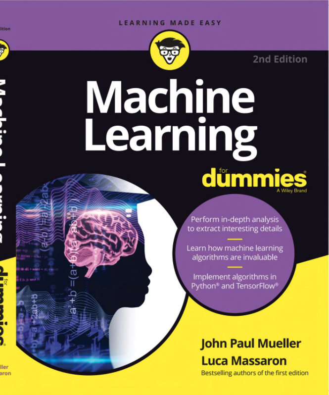

# Machine Learning for Dummies

This repository contains code from [Machine Learning for Dummies](https://www.wiley.com/en-us/Machine+Learning+For+Dummies-p-9781119245513) by John Paul Mueller &amp; Luca Massaron, in the form of Jupyter notebooks and R downloaded from "www.dummies.com".

P.S. - Will be adding my own notes from "Machine for Dummies" by John Paul Mueller &amp; Luca Massaron on the go.
